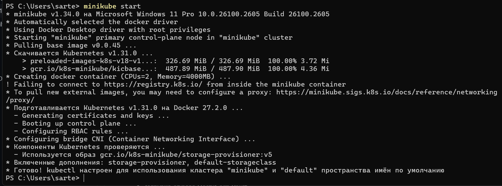
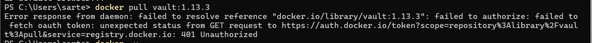
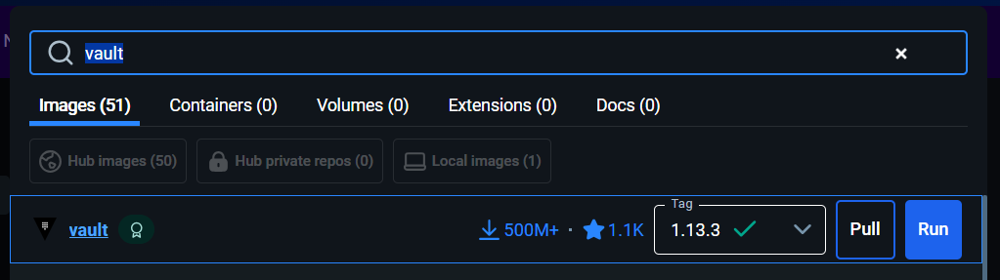
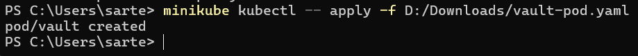
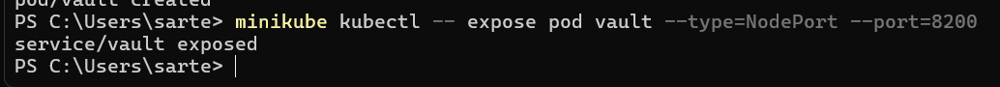
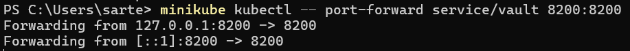
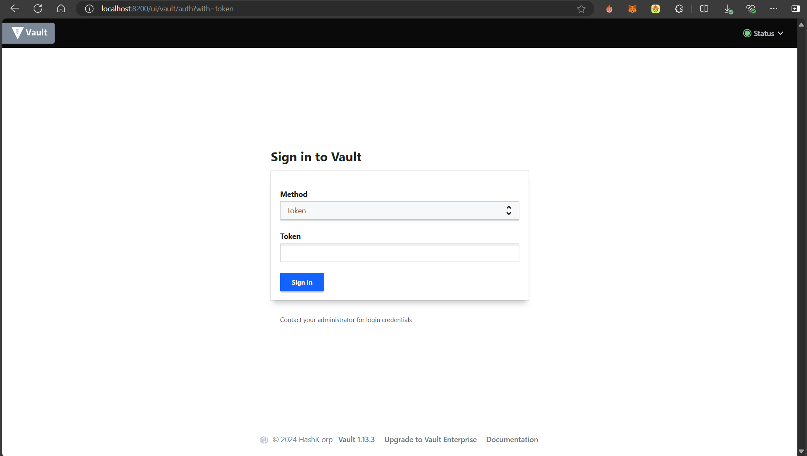
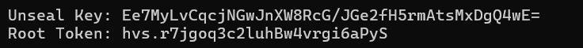
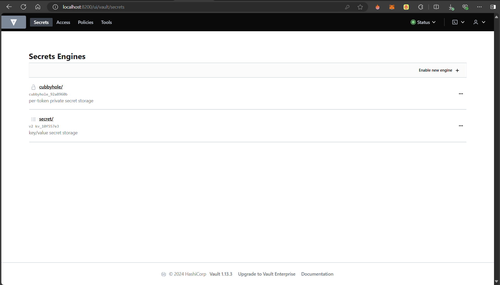
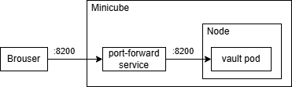

University: [ITMO University](https://itmo.ru/ru/)
Faculty: [FICT](https://fict.itmo.ru)
Course: [Introduction to distributed technologies](https://github.com/itmo-ict-faculty/introduction-to-distributed-technologies)
Year: 2023/2024
Group: K4111c
Author: Kiselev Artem Sergeevich
Lab: Lab1
Date of create: 12.12.2024
Date of finished: 12.12.2024

# Лабораторная работа №1 "Установка Docker и Minikube, мой первый манифест."

#### Описание
Это первая лабораторная работа в которой вы сможете протестировать Docker, установить Minikube и развернуть свой первый "под".

#### Цель работы
Ознакомиться с инструментами Minikube и Docker, развернуть свой первый "под".

#### Выполнение работы
###### 1. Установить Docker и Minikube
Установим Docker с [официального сайта](https://www.docker.com/) для ОС Windows 11
Установим Minikube с [официального сайта](https://minikube.sigs.k8s.io/docs/start/) для ОС Windows 11 используя оригинальную инструкцию

###### 2. Развернуть minikube cluster
Выполним команду в PowerShell для развертывания minikube cluster:
```bash
minikube start
```
Получаем вот такой результат:


Выполним также команду для установки kubectl:
```bash
minikube kubectl
```
###### 3. Загрузить образ HashiCorp Vault
Выполним команду:
```bash
docker pull vault:1.13.3
```

И получаем ошибку:


Все дело в авторизации. Для неё выполним команду:
```bash
docker login -u <username>
```
После этого pull прошел успешно

Как альтернативный вариант устаноки можно использовать Docker Desktop:

###### 4.  Создадим Манифест для развертывания пода с образом HashiCorp Vault
Создадим Манифест для развертывания пода с образом HashiCorp Vault. Структура файла пресдавлена [тут](../vault-pod.yaml) и взята [отсюда](https://hub.docker.com/_/vault/):
```yaml
apiVersion: v1
kind: Pod
metadata:
  name: vault
  labels:
    name: vault
spec:
  containers:
  - name: vault
    image: vault:1.13.3
    ports:
    - containerPort: 8200
```

###### 5. Создадим сервис для доступа к контейнеру
Следующим шагом создадим объект в кластере kurbernets:
```bash
minikube kubectl -- apply -f vault-pod.yaml
```

Удостоверимся, что команда выполнена успешно:


Чтобы попасть в созданный контейнер выполним команду:
```bash
minikube kubectl -- expose pod vault --type=NodePort --port=8200
```
Данная команда создает сервис для пода vault. Сервис будет перенаправлять трафик на под vault через порт 8200
Удостоверимся, что команда выполнена успешно:


###### 6. Прокинем порт для доступа к контейнеру
Установим соединение между портом 8200 на локалке и портом 8200 сервиса vault, который работает внутри кластера Kubernetes:
```bash
minikube kubectl -- port-forward service/vault 8200:8200
```

Удостоверимся, что команда выполнена успешно:


Зайдем на дарес localhost:8200 и удостоверимся, что доступ получен


###### 7. Поиск токена для доступа к vault
Сам ключ хранится отображается в логах контейнера в поде, для вывода логов используем команду:
```bash
minikube kubectl logs vault
```

Получаем ключ и токен:


Войдем в систему с полученным токеном


#### Схема организации контейеров и сервисов
