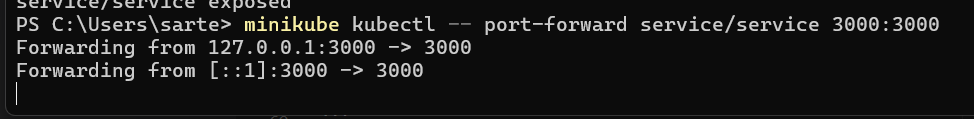

University: [ITMO University](https://itmo.ru/ru/)  \
Faculty: [FICT](https://fict.itmo.ru)  \
Course: [Introduction to distributed technologies](https://github.com/itmo-ict-faculty/introduction-to-distributed-technologies)  \
Year: 2024/2025  \
Group: K4111c  \
Author: Kiselev Artem Sergeevich  \
Lab: Lab2  \
Date of create: 12.12.2024  \
Date of finished: 12.12.2024

# Лабораторная работа №2 "Развертывание веб сервиса в Minikube, доступ к веб интерфейсу сервиса. Мониторинг сервиса."

#### Описание
В данной лабораторной работе вы познакомитесь с развертыванием полноценного веб сервиса с несколькими репликами.

#### Цель работы
Ознакомиться с типами "контроллеров" развертывания контейнеров, ознакомится с сетевыми сервисами и развернуть свое веб приложение.

#### Ход работы
###### 1. Создать deployment с 2 репликами контейнера
Создадим [файл конфигураций](deployment.yaml), в котором зададим тип объекта `kind`, его идентификатор `name`, количество реплик `replicas`, а также спецификация контейнеров, которая включается в себя образ `image`, имя контейнера `name`, и переменные окружения `env`:
```yaml
apiVersion: apps/v1
kind: Deployment
metadata:
  name: deployment
spec:
  replicas: 2
  selector:
    matchLabels:
      app: deployment
  template:
    metadata:
      labels:
        app: deployment
    spec:
      containers:
        - name: frontend
          image: ifilyaninitmo/itdt-contained-frontend:master
          env:
            - name: REACT_APP_USERNAME
              value: "Kavabanga"
            - name: REACT_APP_COMPANY_NAME
              value: "OOO-Kavabanga"
```

Создадим объект Deployment в Kubernates уже знакомой нам командой:
```bash
minikube kubectl -- apply -f deployment.yaml
```

Удостоверимся, что команда выполнена успешно:


###### 2. Создать сервис для доступа к подам
Создадим сервис, доступный только внутри кластера Kubernetes:
```bash
minikube kubectl -- expose deployment deployment --port=3000 --name=service --type=ClusterIP
```

Удостоверимся, что команда выполнена успешно:


###### 4. Пробросим пропсы и подключимся к контейнерам через бразуер
Для проброса портов выполним команду:
```bash
minikube kubectl -- port-forward service/service 3000:3000
```

Удостоверимся, что команда выполнена успешно:


Перейдем на адрес localhost:3000 и посмотрим на результат:


Переменные `REACT_APP_USERNAME` и `REACT_APP_COMPANY_NAME` не изменяются, т.к. это переменные среды, которые были заданы при создании объекта `deployment`, обе эти переменные соовтественно описаны в созданном конфигурационном файле deployment.yaml.  \
Переменная `Container name`, изменяется в зависимости от переадресации из браузера к контейнеру. В нашем случае переадресация происходила к одному и тому же контейнеру.

###### 5. Вывод логов
Прологируем проды при прмощи команд (список подов был получен ранее):
```bash
minikube kubectl logs deployment-fc96f8c65-2ltl8
minikube kubectl logs deployment-fc96f8c65-l2mnq
```
Посмотрим на результат:


### Схема организации контейеров и сервисов
