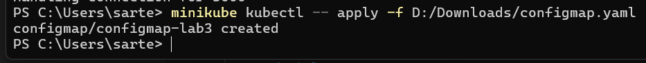
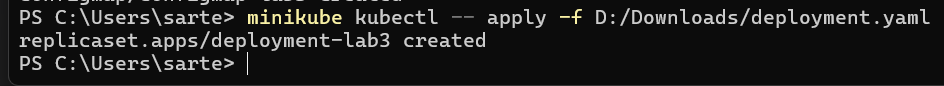
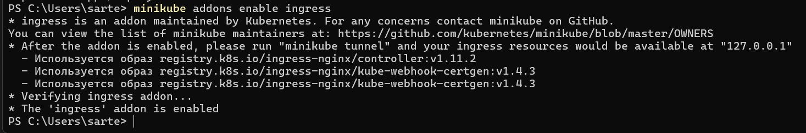
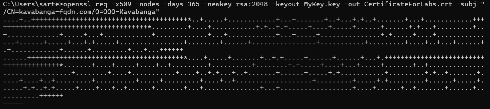
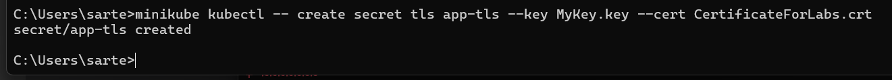
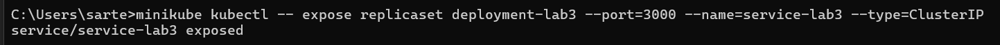
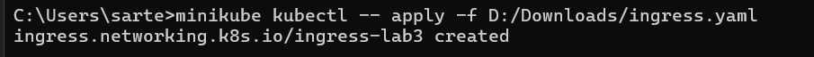
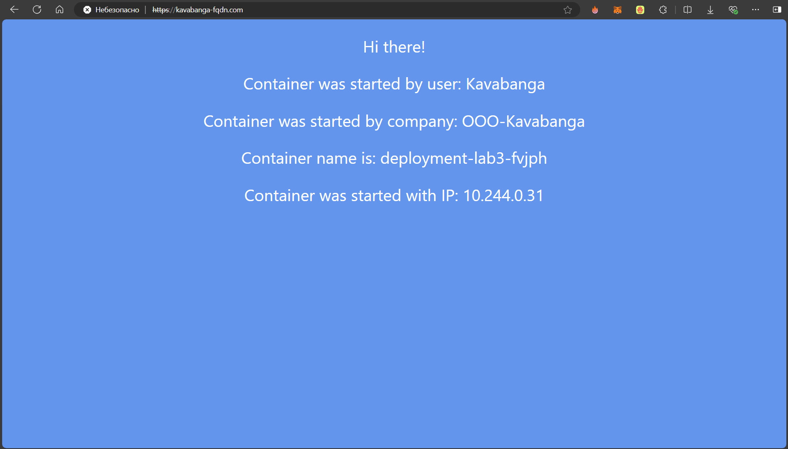
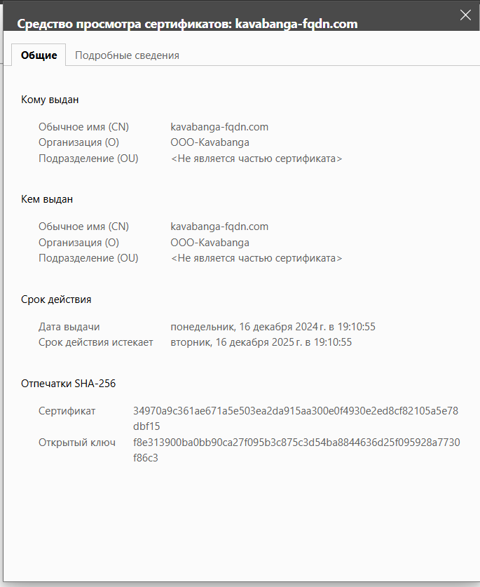
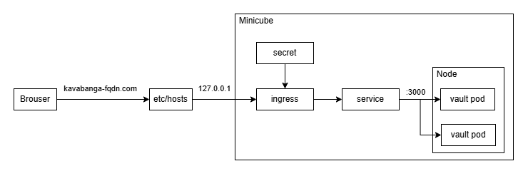

University: [ITMO University](https://itmo.ru/ru/)  \
Faculty: [FICT](https://fict.itmo.ru)  \
Course: [Introduction to distributed technologies](https://github.com/itmo-ict-faculty/introduction-to-distributed-technologies)  \
Year: 2024/2025  \
Group: K4111c  \
Author: Kiselev Artem Sergeevich  \
Lab: Lab3  \
Date of create: 12.12.2024  \
Date of finished: 16.12.2024

# Лабораторная работа №3 "Сертификаты и "секреты" в Minikube, безопасное хранение данных."
### Описание
В данной лабораторной работе вы познакомитесь с сертификатами и "секретами" в Minikube, правилами безопасного хранения данных в Minikube.

### Цель работы
Познакомиться с сертификатами и "секретами" в Minikube, правилами безопасного хранения данных в Minikube.

### Ход работы
###### 1. Создание ConfigMap
Создадим конфигурационный файл [configmap.yaml](./configmap.yaml), в котором задаем значения `REACT_APP_USERNAME` и `REACT_APP_COMPANY_NAME`:
```yaml
apiVersion: v1
kind: ConfigMap
metadata:
  name: configmap-lab3
data:
  REACT_APP_USERNAME: "Kavabanga"
  REACT_APP_COMPANY_NAME: "OOO-Kavabanga"
```

Затем создадим сам объект ConfigMap в среде Kybernetes:
```bash
minikube kubectl -- apply -f configmap.yaml
```
Удостоверимся, что команда выполнена успешно:


###### 2. Создание ReplicaSet
На основе ReplicaSet работает Deployment, основное отличии между ними в том, что Deployment поддерживает механизмы управления версиями. В конфигурационном файле [deployment.yaml](deployment.yaml) описывается конфигурация объекта ReplicaSet. Также в конце указывается ранние созданый объект `configmap-lab-3`, который содержит переменные среды:
```yaml
apiVersion: apps/v1
kind: ReplicaSet
metadata:
  name: deployment-lab3
spec:
  replicas: 2
  selector:
    matchLabels:
      app: deployment-lab3
  template:
    metadata:
      labels:
        app: deployment-lab3
    spec:
      containers:
        - name: frontend
          image: ifilyaninitmo/itdt-contained-frontend:master
          ports:
          - containerPort: 3000
          envFrom:
            - configMapRef:
                name: configmap-lab3
```

После создания файла создается объект ReplicaSet в среде Kybernetes:
```bash
minikube kubectl -- apply -f deployment.yaml
```

Удостоверимся, что команда выполнена успешно:


###### 3.1 Включение Ingress
**Ingress** - это объект Kubernetes, который управляет внешним доступом к сервисам внутри кластера. Он позволяет направлять HTTP(S)-запросы к нужным сервисам на основе правил, например, URL или хост-направления.

Основные функции Ingress:

- Маршрутизация трафика. Позволяет определить, какие запросы должны быть направлены к каким сервисам на основе доменов или путей;
- Обработка SSL/TLS. Поддерживает безопасное соединение при помощи сертификатов, что позволяет шифровать трафик;
- Балансировка нагрузки. Распределяет входящий трафик между репликами приложения.

Создадим ingress в minikube:
```bash
minikube addons enable ingress
```

Удостоверимся, что команда выполнена успешно:


После выполнения нам рекомендуют применить `minikube tunnel`

###### 3.2 Cоздание TLS-сертификата
**TLS-сертификат (Transport Layer Security)** - это цифровой сертификат, используемый для шифрования соединений между клиентами и серверами, обеспечивая защиту передаваемых данных. TLS-сертификат помогает удостоверить подлинность сайта или сервиса, гарантируя пользователям, что их данные передаются безопасно.

В Kubernetes TLS-сертификаты часто применяются вместе с Ingress для организации HTTPS-соединений, обеспечивая безопасное подключение к сервисам внутри кластера. Для этого сертификаты добавляются в кластер Kubernetes в виде Secret-объектов и привязываются к Ingress-ресурсам, чтобы шифровать трафик.

Создадим TLS-сертификат, выполнив команду (Перед этим установим сам OpenSSL):
```bash
openssl req -x509 -nodes -days 365 -newkey rsa:2048 -keyout MyKey.key -out CertificateForLabs.crt -subj "/CN=kavabanga-fqdn.com/O=OOO-Kavabanga"
```
Удостоверимся, что команда выполнена успешно:


В результате создается самоподписанный сертификат `CertificateForLabs.crt` и соответствующий ему закрытый ключ `MyKey.key`, привязанный к домену `kavabanga-fqdn.com`.

Импортируем данный сертификат в Kubernetes, как объект `secret`:
```bash
minikube kubectl -- create secret tls app-tls --key MyKey.key --cert CertificateForLabs.crt
```

Удостоверимся, что команда выполнена успешно:


###### 4. Создание Ingress
Создадим объект Ingress, который использует сервис приложения и секрет с TLS-сертификатом, конфигурация данного объекта описывается файлом [ingress.yaml](./ingress.yaml):
```yaml
apiVersion: networking.k8s.io/v1
kind: Ingress
metadata:
  name: ingress-lab3
spec:
  tls:
  - hosts:
    - kavabanga-fqdn.com
    secretName: app-tls
  rules:
  - host: kavabanga-fqdn.com
    http:
      paths:
      - path: /
        pathType: Prefix
        backend:
          service:
            name: service-lab3
            port:
              number: 3000
```

Перед созданием объекта Ingress создадим сервис, который можно так же описать при помощи конфигурационного файла. 
В нашем случае создадим его по аналогии с предыдущей лабораторной:
```bash
minikube kubectl -- expose replicaset deployment-lab3 --port=3000 --name=service-lab3 --type=ClusterIP
```

Удостоверимся, что команда выполнена успешно:


После создания сервиса и конфигурационного файла создадим объект Ingress:
```bash
minikube kubectl -- apply -f ingress.yaml
```

Удостоверимся, что команда выполнена успешно:


###### 5. Настройка HOSTS

Перейдем в конфигурационный файл `hosts`, расположенный по пути `C:\Windows\System32\drivers\etc` и добавим в нем конфигурацию с найденным IP:
```bash
127.0.0.1 kavabanga-fqdn.com
```

Перейдем по пути `kavabanga-fqdn.com` и посмотрим на результат:


А также на сам сертификат:


### Схема организации контейеров и сервисов
