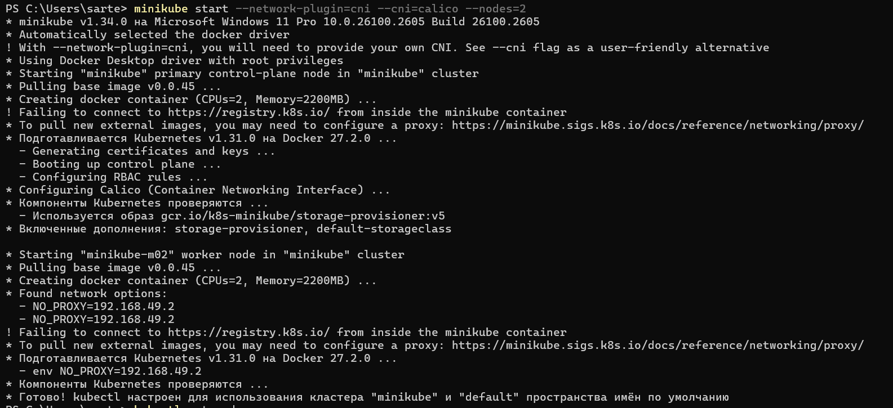
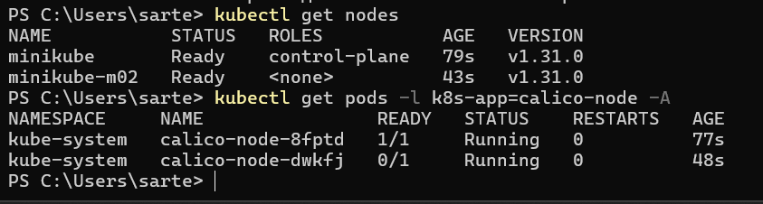
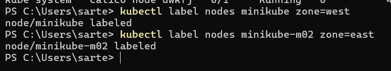
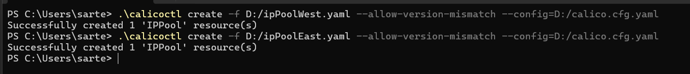
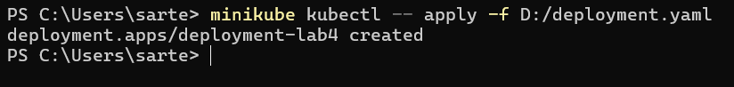
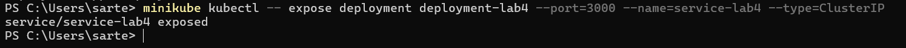
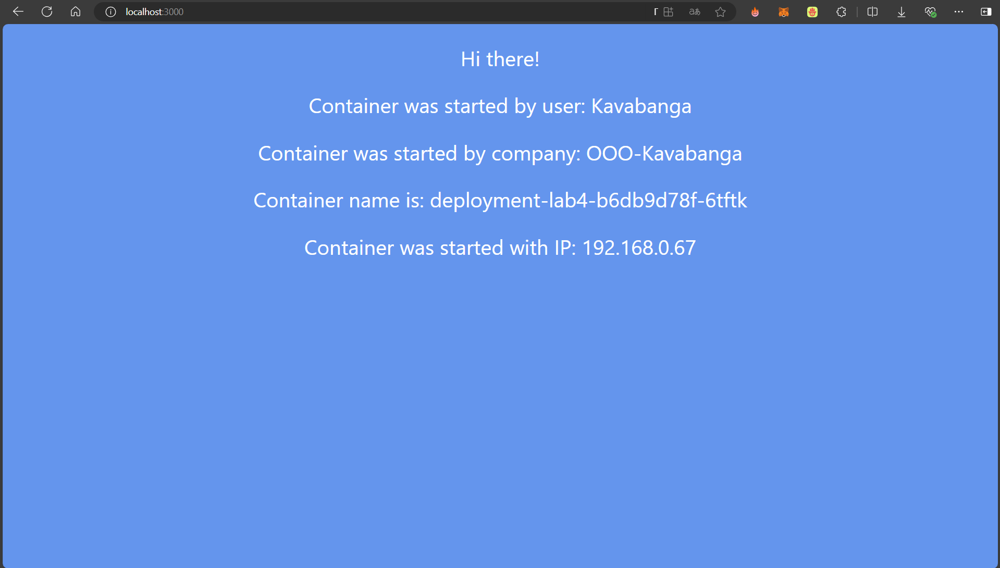
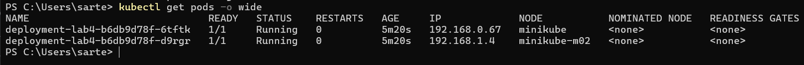
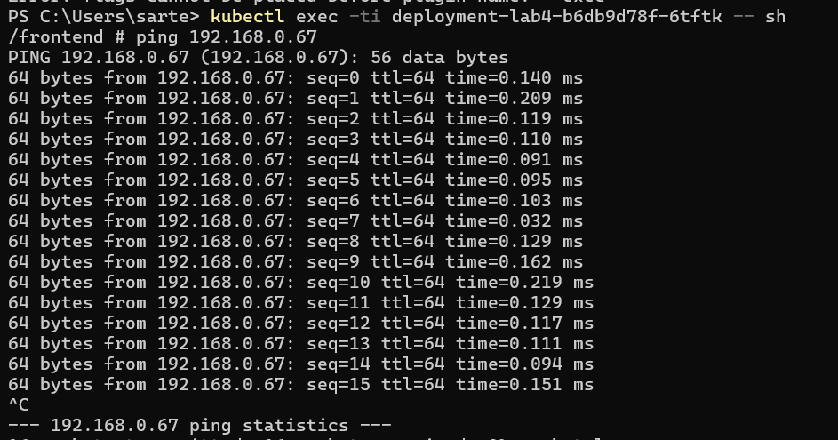
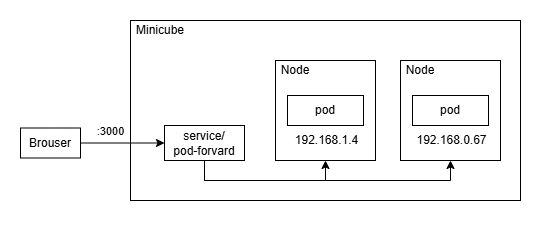

University: [ITMO University](https://itmo.ru/ru/)  \
Faculty: [FICT](https://fict.itmo.ru)  \
Course: [Introduction to distributed technologies](https://github.com/itmo-ict-faculty/introduction-to-distributed-technologies)  \
Year: 2024/2025  \
Group: K4111c  \
Author: Kiselev Artem Sergeevich  \
Lab: Lab4  \
Date of create: 19.12.2024  \
Date of finished: 19.12.2024

# Лабораторная работа №4 "Сети связи в Minikube, CNI и CoreDNS"

### Описание
Это последняя лабораторная работа в которой вы познакомитесь с сетями связи в Minikube. Особенность Kubernetes заключается в том, что у него одновременно работают `underlay` и `overlay` сети, а управление может быть организованно различными CNI.

### Цель работы
Познакомиться с CNI Calico и функцией IPAM Plugin, изучить особенности работы CNI и CoreDNS.

### Ход работы

###### Запуск minikube
При запуске установим плагин `CNI=calico` и режим работы `Multi-Node Clusters`. Мы указываем, что minikube должен использовать стандарт CNI (Container Network Interface) для управления сетями в кластере Kubernetes, в качестве сетевого плагина CNI использовать calico. Также, что создаются две рабочие ноды:
```bash
minikube start --network-plugin=cni --cni=calico --nodes=2
```

Проверим работоспособность команды:


Выполним команды для проверки нод и подов:
```bash
kubectl get nodes
kubectl get pods -l k8s-app=calico-node -A
```

Посмотрим на результат:


###### Маркировка нод
Зададим нодам `label` на основании их условного георграфического расположения. Для этого выполним:
```bash
kubectl label nodes minikube zone=west
kubectl label nodes minikube-m02 zone=east
```

Удостоверимся, что команда выполнена успешно:


###### Назначение IP адресов
Удалим IP-пулы. которые были созданы по-умолчанию. Затем создадим конфигурационные файлы [ipPoolEast.yaml](ipPoolEast.yaml) и [ipPoolWest.yaml](ipPoolWest.yaml), в которых описывается пул IP-адресов для соотвествующих узлов с метками `zone=east` и `zone=west`. С помощью команды `calicoctl create` создадим на основании описания в YAML-файлах новые объекты в Calico, в данном случае это IP-пулы:
```bash
minikube kubectl -- delete ippools default-ipv4-ippool

calicoctl create -f ipPoolWest.yaml --allow-version-mismatch --config=calico.cfg.yaml
calicoctl create -f ipPoolEast.yaml --allow-version-mismatch --config=calico.cfg.yaml
```

P.s. Для успешной работы calico с windows необходимо создать файл конфигурации [calico.cfg.yaml](calico.cfg.yaml). В простом использовании просто прокидывать его с запросом:
```yaml
apiVersion: projectcalico.org/v3
kind: CalicoAPIConfig
metadata:
spec:
  datastoreType: "kubernetes"
  kubeconfig: "C:/users/<userName>/.kube/config"
```

Удостоверимся, что команда выполнена успешно:


Проверим пулы командой:
```bash
calicoctl get ippool -o wide --allow-version-mismatch --config=calico.cfg.yaml
```

Проверим результат:


###### Создание Deployment

Создадим конфигурационный файл [deployment.yaml](deployment.yaml), по аналогии с другими лабораторными в нем задаем тип объекта `kind`, его идентификатор `name`, количество реплик `replicas`, а также спецификация контейнеров, которая включается в себя образ `image`, имя контейнера `name`, и переменные окружения `env`:
```yaml
apiVersion: apps/v1
kind: Deployment
metadata:
  name: deployment-lab4
spec:
  replicas: 2
  selector:
    matchLabels:
      app: deployment-lab4
  template:
    metadata:
      labels:
        app: deployment-lab4
    spec:
      containers:
        - name: frontend
          image: ifilyaninitmo/itdt-contained-frontend:master
          ports:
          - containerPort: 3000
          env:
            - name: REACT_APP_USERNAME
              value: "Kavabanga"
            - name: REACT_APP_COMPANY_NAME
              value: "OOO-Kavabanga"
```

Создадим объект Deployment в Kubernates:
```bash
minikube kubectl -- apply -f deployment.yaml
```

Проверим результат:


###### Cоздание сервиса
Для создания сервиса выполним команду:
```bash
minikube kubectl -- expose deployment deployment-lab4 --port=3000 --name=service-lab4 --type=ClusterIP
```

Проверим результат:


###### Проверка работоспособности
Пробросим порты командой:
```bash
minikube kubectl -- port-forward service/service-lab4 3000:3000
```

Перейдем на `localhost:3000` и проверим результат:


Как можно видеть, поду был присвоен адрес из пула, который был задан ранее. В данном случае подключение произошло к ноде с меткой `zone=east`.

###### Пинг подов
Выведем IP-адреса подов, с помощью команды:
```bash
kubectl get pods -o wide
```

Проверим результат:


Затем подключимся к каждому из подов и проверим доступность другого пода с помощью команды ping:


### Схема организации контейеров и сервисов  




